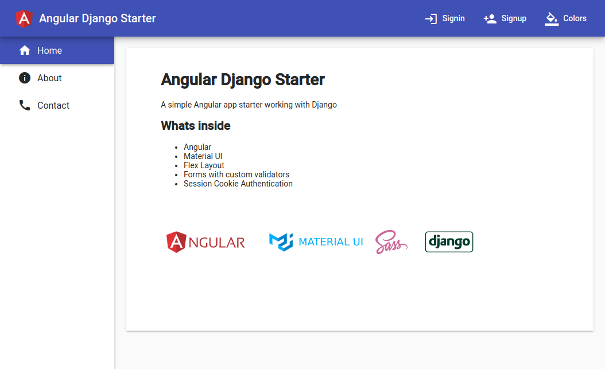

# Angular Django Starter

**This is**

- An Angular 12 project
- That works with Django backend

**Themed with:**

- Material UI
- Flexlayout
- Sass

**Implements:**

- Responsive design
- Light / Dark theme
- Custom Form Validators
- Session Cookie Authentication

**Looks like:**



---

## Backend

### Dependencies

```bash
sudo apt install virtualenv
sudo apt install python3-pip
```

### Install

```bash
git clone https://stevaidis.mywire.org:4080/jaba/angular-django-starter-back.git
cd angular-django-starter-back
virtualenv venv
source venv/bin/activate
pip3 install -r requirements.txt
python manage.py makemigrations
python manage.py migrate
```

### Run

```bash
python manage.py runserver 127.0.0.1:8000
```

---

## Frontend
### Dependencies

```bash
curl -sL https://deb.nodesource.com/setup_12.x | sudo -E bash -
sudo apt install nodejs
sudo npm install -g @angular/cli
```

### Install

```bash
git clone https://github.com/vaidis/angular-django-starter.git
cd angular-django-starter
npm i
```

### Run

```bash
ng serve --host 0.0.0.0
```

### Build
```
ng build --prod
```

---

## Todo

- Complete the tests
- Contact form
- More data for profile page
